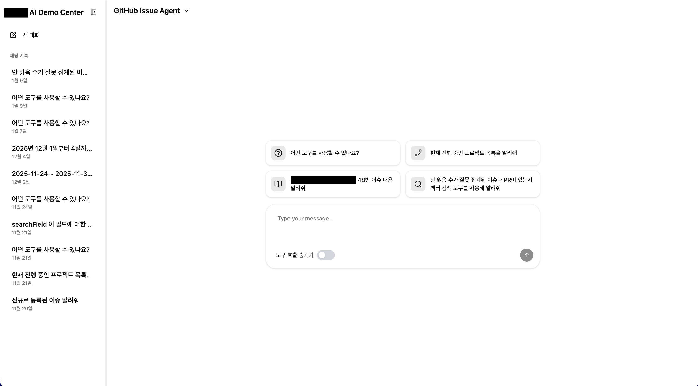
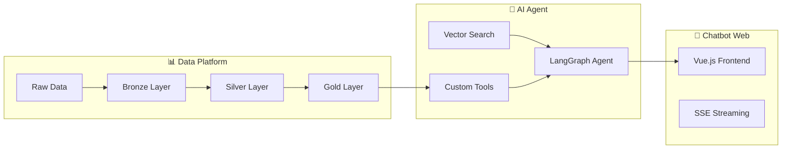

# 데이터 플랫폼 에이전트 개발

> **End-to-End AI Agent 개발**: 데이터 기획/수집/가공 → Tool 설계 → 에이전트 개발 → 웹 UI 구현

## 🎯 프로젝트 개요

이 포트폴리오는 기업용 AI 에이전트 시스템을 **End-to-End**로 개발한 경험을 보여줍니다. 데이터 레이크하우스 구축부터 LLM 기반 에이전트 개발, 그리고 사용자 인터페이스까지 전 과정을 직접 설계하고 구현했습니다.
> ⚠️ **참고**: 실제 프로젝트에서 사용된 코드를 기반으로 작성되었으며, 회사/고객 정보는 익명화 처리되었습니다.

**📅 프로젝트 기간**: 2025년 7월 – 2025년 11월

## 📁 프로젝트 구조

| 폴더 | 설명 | 핵심 기술 |
| ------ | ------ | ----------- |
| [docs/](./docs/) | 프로젝트 기획 문서 | 데이터 설계, Tool 설계, 성과 분석 |
| [data-platform/](./data-platform/) | 데이터 레이크하우스 ETL 파이프라인 | Spark, Iceberg, Airflow, MinIO |
| [langgraph-api/](./langgraph-api/) | LLM 기반 AI 에이전트 백엔드 | LangGraph, LangChain, Milvus, Trino |
| [chatbot-web/](./chatbot-web/) | 챗봇 웹 프론트엔드 | Vue.js, TypeScript, SSE |

## 📋 프로젝트 기획

이 프로젝트는 단순한 기술 구현이 아닌, **비즈니스 문제 정의 → 데이터 설계 → AI Tool 구현** 전 과정을 주도했습니다.

| 문서 | 설명 |
| ------ | ------ |
| [프로젝트 개요](./docs/01_project_overview.md) | 추진 배경, 목적, 기대 효과 |
| [데이터 레이어 설계](./docs/02_data_layer_design.md) | Bronze → Silver → Gold 3단계 설계 |
| [AI Tool 설계](./docs/03_tool_design.md) | 5개 분석 도구 입출력 스펙 |
| [프로젝트 성과](./docs/04_project_results.md) | CX/DX/DT 관점 가치와 제언 |
| [🔥 기술적 챌린지](./docs/05_challenges.md) | 핵심 과제와 해결 방법 |

## 🔥 핵심 챌린지

> 자세한 내용은 [기술적 챌린지 & 해결](./docs/05_challenges.md) 문서를 참조하세요.

### 1. 엔드투엔드 아키텍처 설계

**문제**: 처음부터 전체 구조를 설계해야 하는 상황  
**해결**: AI가 이해할 수 있는 형태로 데이터/스키마를 문서화하고, LLM과 함께 설계 검토

### 2. 현업 요구사항 이해

**문제**: 업무 흐름과 고충 이해 부족  
**해결**: 티타임/회의로 현업 목소리 청취 → GitHub 이슈 프로젝트, GCLD 에이전트로 연결

### 3. 스트리밍 마크다운 렌더링

**문제**: SSE 스트리밍 중 불완전한 테이블 파싱 실패  
**해결**: 테이블 자동 완성 로직 구현

## 🛠️ 기술 스택

### Data Engineering

- **Storage**: MinIO (S3 호환 Object Storage)
- **Table Format**: Apache Iceberg (ACID 트랜잭션, Time Travel)
- **Processing**: Apache Spark 3.5
- **Orchestration**: Apache Airflow (Celery Executor)
- **Query Engine**: Trino (분산 SQL 엔진)

### AI/ML

- **Agent Framework**: LangGraph, LangChain
- **LLM**: Ollama (Self-hosted LLM)
- **Vector Database**: Milvus (Dense + Sparse Hybrid Search)
- **Embedding**: BGE-M3 (Multi-lingual)

### Frontend

- **Framework**: Vue.js 3 + TypeScript
- **Styling**: Tailwind CSS, shadcn/ui
- **Real-time**: Server-Sent Events (SSE)

## 🚀 핵심 역량

### 1. 데이터 파이프라인 설계 (Bronze → Silver → Gold)

- Google Sheets/외부 API 데이터 수집 자동화
- 스키마 정규화 및 데이터 품질 검증
- 비즈니스 지표 테이블 설계 (고객 마스터, 매출 분석 등)

### 2. AI Tool 설계

- Trino SQL 쿼리 기반 분석 도구
- Milvus Hybrid Vector Search (Dense + Sparse 가중 결합)
- 페이지네이션, 필터링, 에러 핸들링 구현

### 3. 에이전트 아키텍처 설계

- LangGraph 기반 멀티턴 대화 에이전트
- Context 관리 미들웨어 (Token 절약, 히스토리 압축)
- System Prompt 엔지니어링

### 4. 프론트엔드 개발

- SSE 기반 실시간 스트리밍 UI
- 마크다운/테이블 실시간 파싱 렌더링
- 사용자 피드백 수집 UI (복사, 좋아요/싫어요)

## 📝 주요 성과

- **자동화된 ETL 파이프라인**: 일일 스케줄 기반 데이터 파이프라인 운영
- **사내 업무 지원 에이전트**: 프로젝트 관리, 이슈 추적, 사례 검색 지원
  - GitHub 이슈 에이전트, GCLD 영업 에이전트 등 개발
  - 영업팀이 직접 운영 데이터 조회 및 분석 가능한 환경 구축
- **하이브리드 검색**: Dense + Sparse 벡터 검색으로 검색 정확도 향상

## 💡 핵심 교훈

| 영역 | 배운 점 |
| ------ | ------- |
| **설계** | AI/LLM이 이해할 수 있는 형태로 데이터를 문서화하면 설계 품질이 높아짐 |
| **현업 이해** | 티타임/회의로 업무 흐름과 고충을 이해해야 "도움이 되는 시스템"이 됨 |
| **구조화** | 본문=Markdown, 메타데이터=Iceberg 테이블 통일이 다양한 소스 통합에 효과적 |

## 📫 Contact

- **Email**: <anc5557@naver.com>
- **GitHub**: [github.com/anc5557](https://github.com/anc5557)

---
