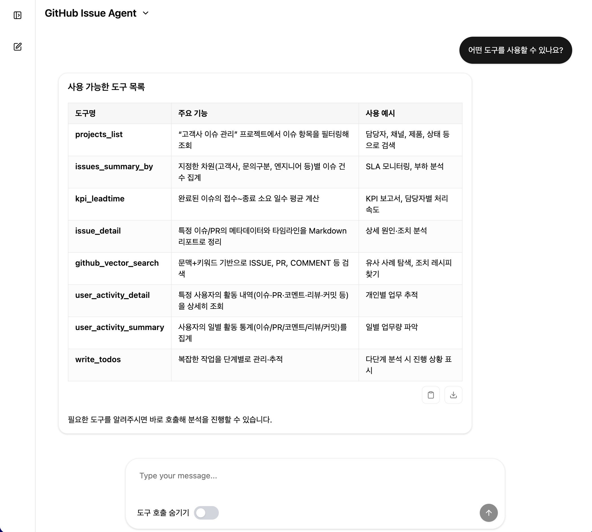
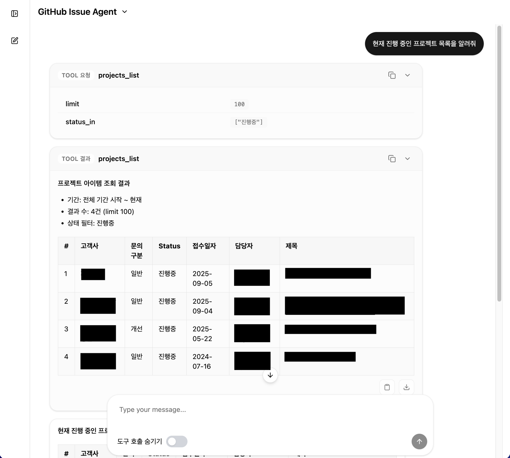

# 💬 Chatbot Web - AI 챗봇 프론트엔드

## 개요

Vue.js 3 + TypeScript 기반의 AI 챗봇 웹 인터페이스입니다. SSE(Server-Sent Events)를 활용하여 실시간 스트리밍 응답을 렌더링합니다.

### 스크린샷

| AI Tool 목록 | Tool 실행 결과 |
| --- | --- |
|  |  |

## 기술 스택

| 구성요소 | 기술 | 용도 |
| --------- | ------ | ------ |
| Framework | Vue.js 3 | 반응형 UI |
| Language | TypeScript | 타입 안정성 |
| Styling | Tailwind CSS, shadcn/ui | 모던 UI 컴포넌트 |
| Real-time | SSE | 스트리밍 응답 |

## 🚀 실행 방법

### 1. 의존성 설치

```bash
npm install
```

### 2. 개발 서버 실행

```bash
npm run dev
```

### 3. 환경 변수 설정

```bash
# .env 파일
VITE_API_BASE_URL=http://localhost:8000
VITE_SSE_ENDPOINT=/api/v1/ai/stream
```

### 4. 빌드

```bash
npm run build
npm run preview  # 빌드 결과 확인
```

## 핵심 기능

### 1. 실시간 SSE 스트리밍

```typescript
// SSE 연결 및 스트리밍 처리
const eventSource = new EventSource(`/api/chat?message=${query}`)

eventSource.onmessage = (event) => {
  const chunk = JSON.parse(event.data)
  messages.value += chunk.content
  // 실시간 마크다운 파싱
  renderedContent.value = marked.parse(messages.value)
}

eventSource.onerror = () => {
  // 연결 종료 또는 에러 처리
  eventSource.close()
}
```

> 💡 **왜 SSE인가?**
>
> - WebSocket보다 가벼움 (HTTP 기반)
> - 단방향 스트리밍에 적합 (AI 응답)
> - 자동 재연결 지원

### 2. 마크다운/테이블 실시간 파싱

스트리밍 중 불완전한 테이블도 올바르게 렌더링:

```typescript
// 불완전한 테이블 감지 및 보완
function completeIncompleteTable(content: string): string {
  const lines = content.split('\n')
  
  // 테이블 헤더가 있지만 구분선이 없는 경우
  if (hasTableHeader && !hasSeparator) {
    lines.splice(headerIndex + 1, 0, generateSeparator(columnCount))
  }
  
  // 마지막 행이 불완전한 경우 셀 채우기
  if (lastRowCells < columnCount) {
    lines[lines.length - 1] += ' |'.repeat(columnCount - lastRowCells)
  }
  
  return lines.join('\n')
}
```

### 3. 사용자 피드백 UI

| 기능 | 설명 |
| ------ | ------ |
| 복사 버튼 | 메시지 내용을 클립보드에 복사 |
| 좋아요/싫어요 | AI 응답 품질 피드백 수집 |
| 호버 인터랙션 | 마우스 호버 시 버튼 표시 |

### 4. ChatGPT 스타일 UI

- **사용자 메시지**: 오른쪽 정렬, 둥근 버블 스타일
- **AI 메시지**: 왼쪽 정렬, 플레인 텍스트 스타일
- **입력창**: 자동 높이 조절, 둥근 모서리

## 폴더 구조

```text
chatbot-web/
└── src/
    ├── api/
    │   └── ai.api.ts          # API 연동 함수
    └── components/
        └── chat/
            ├── ChatInput.vue   # 채팅 입력 컴포넌트
            └── ChatMessage.vue # 메시지 렌더링 컴포넌트
```

## 주요 컴포넌트 설명

### ChatInput.vue

- **자동 높이 조절**: 텍스트 입력에 따라 textarea 높이 자동 조절
- **키보드 단축키**: Enter로 전송, Shift+Enter로 줄바꿈
- **전송/중단 토글**: 스트리밍 중 중단 버튼 표시

```vue
<template>
  <div class="chat-input-container">
    <textarea
      v-model="inputText"
      @keydown="handleKeydown"
      :style="{ height: textareaHeight + 'px' }"
      placeholder="메시지를 입력하세요..."
    />
    <button @click="isStreaming ? stopStream() : sendMessage()">
      {{ isStreaming ? '⬜ 중단' : '➤ 전송' }}
    </button>
  </div>
</template>
```

### ChatMessage.vue

- **마크다운 렌더링**: `marked` 라이브러리 사용
- **코드 하이라이팅**: 코드 블록 복사 기능
- **피드백 버튼**: 좋아요/싫어요 상태 관리

## 디자인 결정 사항

### 1. SSE vs WebSocket

| 항목 | SSE | WebSocket |
| ------ | ------ | ------ |
| 방향 | 단방향 (서버→클라이언트) | 양방향 |
| 프로토콜 | HTTP | WS |
| 재연결 | 자동 | 수동 구현 필요 |
| **선택 이유** | AI 응답은 단방향이므로 SSE가 적합 | - |

### 2. 실시간 테이블 렌더링

스트리밍 중 마크다운 테이블이 불완전하게 도착하면 `marked.parse()`가 실패합니다.
이를 해결하기 위해 테이블 완성 로직을 추가했습니다:

1. 테이블 시작 감지 (`|` 문자로 시작)
2. 구분선 존재 여부 확인 (`|---|`)
3. 없으면 임시 구분선 삽입
4. 불완전한 행 패딩

## 예시 코드

| 파일 | 설명 |
| ------ | ------ |
| [ChatInput.vue](./src/components/chat/ChatInput.vue) | 채팅 입력 UI, 자동 높이 조절 |
| [ChatMessage.vue](./src/components/chat/ChatMessage.vue) | 메시지 렌더링, 피드백 버튼 |
| [ai.api.ts](./src/api/ai.api.ts) | SSE 연결, API 호출 로직 |
