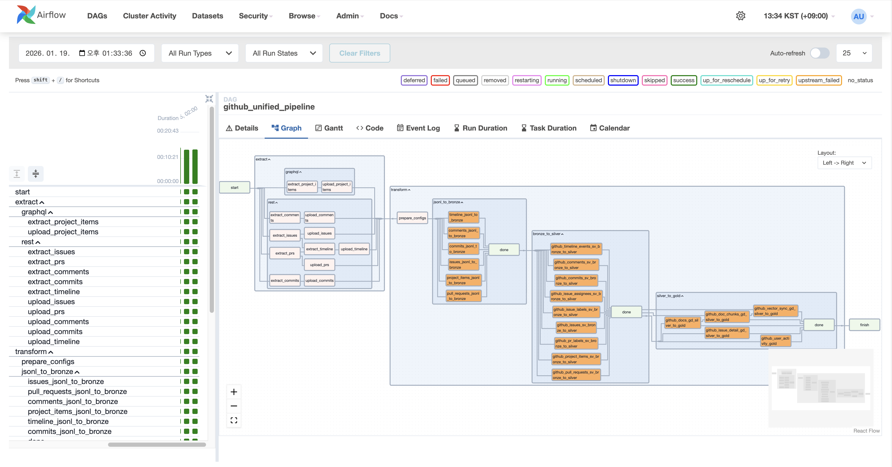
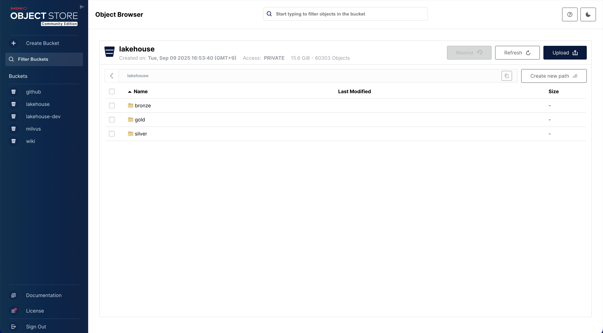
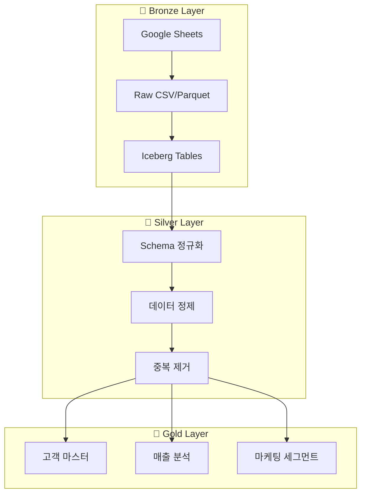

# 📊 Data Platform - 데이터 레이크하우스 ETL 파이프라인

## 개요

Apache Iceberg 기반 데이터 레이크하우스에서 **Bronze → Silver → Gold** 레이어 아키텍처를 구현한 ETL 파이프라인입니다.

### 스크린샷

| Airflow DAG 파이프라인 | MinIO Object Storage |
| --- | --- |
|  |  |



## 기술 스택

| 구성요소 | 기술 | 용도 |
| ------ | ------ | ------ |
| Object Storage | MinIO | S3 호환 데이터 레이크 |
| Table Format | Apache Iceberg | ACID 트랜잭션, Time Travel |
| Processing | Apache Spark 3.5 | 분산 데이터 처리 |
| Orchestration | Apache Airflow | DAG 스케줄링, 모니터링 |
| Query Engine | Trino | 분산 SQL 쿼리 |

## 폴더 구조

```text
data-platform/
├── configs/
│   └── docker-compose.example.yml  # Docker 서비스 설정 예시
├── dags/
│   └── example_unified_pipeline_dag.py  # Airflow 통합 DAG
└── spark-apps/
    ├── example_bronze_to_silver.py # Bronze → Silver 변환
    └── example_silver_to_gold.py   # Silver → Gold 집계
```

## 🚀 실행 방법

### 1. Docker Compose로 환경 구성

```bash
# 전체 서비스 실행
docker-compose -f configs/docker-compose.example.yml up -d

# 상태 확인
docker-compose ps
```

### 2. 서비스 접속 정보

| 서비스 | URL | 기본 계정 |
| ------ | ------ | ------ |
| MinIO Console | <http://localhost:9001> | admin / password |
| Airflow UI | <http://localhost:8080> | airflow / airflow |
| Trino UI | <http://localhost:8082> | - |
| Spark UI | <http://localhost:4040> | - |
| Superset | <http://localhost:8088> | admin / admin |

### 3. Airflow DAG 트리거

```bash
# DAG 활성화
docker exec -it airflow-webserver \
  airflow dags unpause unified_etl_pipeline

# 수동 실행
docker exec -it airflow-webserver \
  airflow dags trigger unified_etl_pipeline
```

### 4. Spark 작업 직접 실행 (개발용)

```bash
# Spark container에서 실행
docker exec -it spark-master \
  spark-submit \
    --master spark://spark-master:7077 \
    --conf spark.sql.catalog.iceberg=org.apache.iceberg.spark.SparkCatalog \
    /opt/spark-apps/example_bronze_to_silver.py \
    --bronze-bucket bronze \
    --silver-bucket silver \
    --dataset example
```

### 5. Trino에서 데이터 확인

```bash
# Trino CLI 접속
docker exec -it trino trino

# 쿼리 예시
trino> USE iceberg.silver;
trino> SHOW TABLES;
trino> SELECT * FROM customer_usage LIMIT 10;
```

## 핵심 설계 포인트

### 1. 레이어 아키텍처

- **Bronze**: 원천 데이터를 최소 가공으로 저장 (스키마 온 리드)
- **Silver**: 정규화, 타입 캐스팅, 중복 제거 적용
- **Gold**: 비즈니스 질문에 바로 답할 수 있는 지표 테이블

### 2. Iceberg 활용

```python
# 파티션 + 정렬 최적화
df.writeTo(f"silver.{table_name}") \
    .partitionedBy("year_month") \
    .option("sort-order", "customer_id") \
    .createOrReplace()
```

### 3. Airflow DAG 패턴

```python
# TaskGroup으로 단계별 그룹화
with TaskGroup(group_id="transform") as transform_group:
    jsonl_to_bronze >> bronze_to_silver >> silver_to_gold

# 전체 파이프라인 의존성
start >> extract_group >> transform_group >> load_group >> end
```

## 예시 코드

| 파일 | 설명 |
| ------ | ------ |
| [docker-compose.example.yml](./configs/docker-compose.example.yml) | 전체 서비스 Docker 설정 |
| [example_unified_pipeline_dag.py](./dags/example_unified_pipeline_dag.py) | Airflow 통합 ETL DAG |
| [example_bronze_to_silver.py](./spark-apps/example_bronze_to_silver.py) | 원천 데이터 정제 로직 |
| [example_silver_to_gold.py](./spark-apps/example_silver_to_gold.py) | 비즈니스 지표 계산 로직 |
