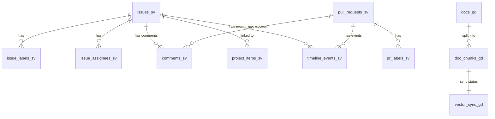

# 데이터 레이어 설계

## 설계 철학

AI 에이전트가 데이터를 효과적으로 활용하려면 **데이터가 AI가 이해할 수 있는 형태로 구조화**되어야 합니다.

이를 위해 **Medallion Architecture (Bronze → Silver → Gold)** 3단계 레이어를 설계했습니다.

```text
┌─────────────────────────────────────────────────────────────────┐
│                        Data Sources                              │
│  GitHub API (Issues, PRs, Comments, Projects, Timeline)          │
└───────────────────────────────┬─────────────────────────────────┘
                                │
                                ▼
┌─────────────────────────────────────────────────────────────────┐
│  Bronze Layer - 원본 데이터 보관소                               │
│  - JSON 구조 그대로 저장                                         │
│  - 데이터 타입 최소 변환 (주로 STRING)                          │
│  - 중복 허용 (재수집 시 append)                                 │
└───────────────────────────────┬─────────────────────────────────┘
                                │ 정제/타이핑/정규화
                                ▼
┌─────────────────────────────────────────────────────────────────┐
│  Silver Layer - 분석용 정제 데이터                               │
│  - 타입 안정성 (TIMESTAMP, DATE, BIGINT)                        │
│  - 배열 정규화 (labels, assignees → 별도 테이블)                │
│  - 업서트 방식 (중복 제거, 최신 데이터만 유지)                  │
└───────────────────────────────┬─────────────────────────────────┘
                                │ 문서화/청킹/임베딩
                                ▼
┌─────────────────────────────────────────────────────────────────┐
│  Gold Layer - AI 분석용 최적화 데이터                            │
│  - 문서 단위 텍스트 정규화 (10가지 정제 규칙)                   │
│  - 청킹 (max 3600자, 15% 오버랩)                                │
│  - 벡터 DB 동기화 상태 관리                                     │
│  - 에이전트용 통합 상세 뷰                                      │
└─────────────────────────────────────────────────────────────────┘
```

---

## Bronze Layer

### Bronze 목적

GitHub API로부터 수집한 원본 데이터를 **변경 없이 저장** (Raw Data Lake)

### Bronze 특징

- JSON 구조 그대로 저장
- 파티션: `ingest_date` (수집일자)
- 문제 발생 시 "원본 로그" 역할

### Bronze 테이블 목록

| 테이블명 | 설명 | 파티션 키 | 주요 키 |
| ------ | ------ | ----------- | --------- |
| `github_issues_bz` | 이슈 원본 데이터 | `ingest_date` | `issue_id` |
| `github_pull_requests_bz` | PR 원본 데이터 | `ingest_date` | `pr_id` |
| `github_comments_bz` | 코멘트 원본 데이터 | `ingest_date` | `comment_id` |
| `github_project_items_bz` | 프로젝트 아이템 원본 | `ingest_date` | `project_item_id` |
| `github_timeline_bz` | 타임라인 이벤트 원본 | `ingest_date` | `event_uid` |

---

## Silver Layer

### Silver 목적

브론즈 데이터를 **타이핑, 정규화, 클린징**하여 분석 가능한 형태로 변환

### Silver 특징

- 타입 안정성 (TIMESTAMP → UTC 표준화)
- 배열 정규화 (labels, assignees → 별도 매핑 테이블)
- 업서트 방식 (중복 제거, 최신 데이터만 유지)
- 파생 컬럼 추가 (`created_date`, `lead_time` 등)

### Silver 테이블 목록

| 테이블명 | 설명 | 업서트 키 |
| ------ | ------ | ----------- |
| `github_issues_sv` | 이슈 클린 스냅샷 | `issue_id` |
| `github_issue_labels_sv` | 이슈-라벨 매핑 | `(issue_id, label_name)` |
| `github_issue_assignees_sv` | 이슈-담당자 매핑 | `(issue_id, assignee)` |
| `github_pull_requests_sv` | PR 클린 스냅샷 | `pr_id` |
| `github_pr_labels_sv` | PR-라벨 매핑 | `(pr_id, label_name)` |
| `github_comments_sv` | 코멘트 클린 | `comment_id` |
| `github_project_items_sv` | 프로젝트 아이템 + 비즈니스 필드 | `project_item_id` |
| `github_timeline_events_sv` | 타임라인 이벤트 정규화 | `event_uid` |

### 주요 변환 규칙

```sql
-- 타임스탬프 표준화
created_at STRING(ISO8601) → TIMESTAMP(3) UTC

-- 상태 정규화
state → 'OPEN' / 'CLOSED' 만 허용

-- 케이싱 정규화
author, assignee, label → 소문자 트림

-- 배열 정규화
labels ARRAY<STRING> → 별도 매핑 테이블로 explode
```

---

## Gold Layer

### Gold 목적

벡터 임베딩을 위한 **텍스트 정규화/청킹**과, 에이전트 쿼리를 위한 **통합 상세 뷰** 제공

### Gold 특징

- 문서 단위 텍스트 정규화 (10가지 정제 규칙)
- 문자 기준 청킹 (max 3600자, 약 900 토큰, 15% 오버랩)
- Milvus 동기화 상태 관리 (증분 처리)

### Gold 테이블 목록

| 테이블명 | 설명 | 주키 |
| ------ | ------ | ------ |
| `github_docs_gd` | 문서 단위 정규화 | `doc_uid` |
| `github_doc_chunks_gd` | 청크 단위 분할 (임베딩 대상) | `chunk_uid` |
| `github_vector_sync_gd` | Milvus 동기화 상태 관리 | `chunk_uid` |
| `github_issue_detail_gd` | 에이전트용 이슈/PR 통합 상세 | `issue_id` |

### 텍스트 정규화 규칙 (10가지)

1. **문자/공백 정규화**: Unicode NFKC, 제어문자 제거
2. **이모지/장식 제거**: 시각적 장식 제거
3. **Markdown 처리**: 헤더/리스트 보존, 인용문 처리
4. **코드블록 처리**: 본문에서 분리
5. **링크/URL**: Markdown 링크 변환, URL 원문 유지
6. **HTML**: 단순 태그 제거, 스크립트 블록 제거
7. **GitHub 토큰**: @멘션, #이슈 유지
8. **제목/본문 결합**: doc_type별 포맷 적용
9. **길이 보정**: 짧은 라인 문단 합치기
10. **PII**: 원문 유지 (사내 전용)

### 청킹 전략

```python
# 문자 기반 청킹
max_chars = 3600      # 약 900 토큰
overlap = 0.15        # 15% 오버랩 (540자)
strategy = "sentence" # 문장 경계 기준 분할
```

---

## 데이터 관계도



---

## 운영 원칙

### DAG 처리 방식

- **Idempotent MERGE**: Bronze → Silver → Gold 모두 Iceberg MERGE 사용
- **증분 처리**: 파티션별 처리로 효율성 확보
- **재처리 안전성**: 동일 파티션 재실행 시 결과 동일

### 파티셔닝

- **파티션 키**: `ingest_date` (YYYY-MM-dd)
- **보존 정책**: 전체 이력 보존
- **압축**: Parquet + Snappy

### 데이터 품질

- **DQ Rule 테이블**: 위반 레코드 격리 저장
- **참조 무결성**: 정기적 외래키 검증
- **중복 제거**: 업서트 키 기반 최신 레코드만 유지
