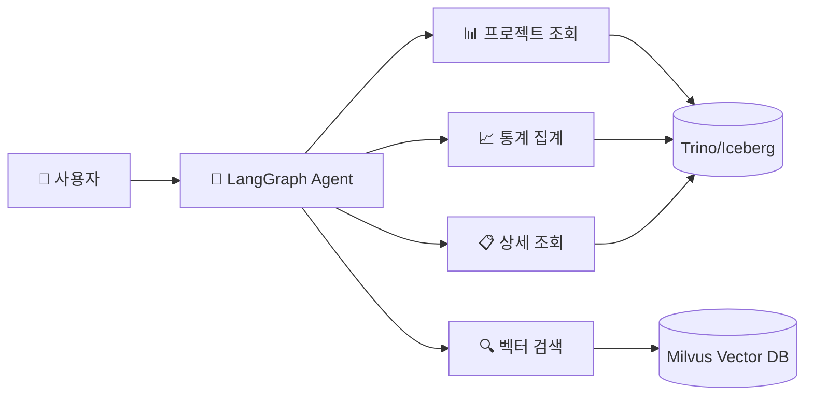

# 🤖 LangGraph API - AI 에이전트 백엔드

## 개요

LangGraph 기반의 AI 에이전트 API입니다. Trino(Iceberg 카탈로그) 데이터와 Milvus 벡터 검색을 활용하여 업무 분석 및 사례 검색을 지원합니다.



## 기술 스택

| 구성요소 | 기술 | 용도 |
| --------- | ------ | ------ |
| Agent Framework | LangGraph, LangChain | 에이전트 그래프 구성 |
| LLM | Ollama + ChatOllama | Self-hosted LLM 추론 |
| Vector DB | Milvus | Dense + Sparse 하이브리드 검색 |
| SQL Engine | Trino | Iceberg 테이블 쿼리 |

## 폴더 구조

```text
langgraph-api/
└── src/
    ├── agent/
    │   └── example_agent.py        # 에이전트 그래프 정의
    ├── tools/
    │   └── example_tools.py        # Custom Tool 구현
    ├── search/
    │   └── hybrid_vector_search.py # 하이브리드 벡터 검색
    └── middleware/
        └── context_editing.py      # 컨텍스트 토큰 관리
```

## 🚀 실행 방법

### 1. 의존성 설치

```bash
pip install langchain langchain-ollama pymilvus trino pydantic python-dotenv
```

### 2. 환경 변수 설정

```bash
# .env 파일
OLLAMA_URL=http://localhost:11434
OLLAMA_CHAT_MODEL=llama3.1:8b
OLLAMA_MODEL=bge-m3

TRINO_HOST=localhost
TRINO_PORT=8082
TRINO_CATALOG=iceberg
TRINO_SCHEMA=gold

MILVUS_HOST=localhost
MILVUS_PORT=19530
MILVUS_COLLECTION=documents
```

### 3. API 호출 예시 (Python)

```python
from langchain_core.messages import HumanMessage
from agent.example_agent import graph

# 에이전트 호출
result = graph.invoke({
    "messages": [
        HumanMessage(content="최근 3개월 이슈 현황 요약해줘")
    ]
})

for msg in result["messages"]:
    print(msg.content)
```

### 4. 독립 Tool 테스트

```python
from tools.example_tools import issues_summary_tool

result = issues_summary_tool(
    group_by="customer",
    start_date="2025-01-01",
    end_date="2025-03-31",
)
print(result)
```

## 핵심 설계 포인트

### 1. 에이전트 아키텍처 + 미들웨어

```python
from langchain.agents import create_agent
from langchain_ollama import ChatOllama

model = ChatOllama(model="llama3.1:8b", temperature=0.0)
tools = [projects_list, issues_summary, vector_search]

graph = create_agent(
    model=model,
    tools=tools,
    middleware=[
        # 멀티스텝 태스크 추적
        TodoListMiddleware(),
        
        # 컨텍스트 토큰 관리
        # 7000 토큰 초과 시 오래된 Tool 결과 정리
        ContextEditingMiddleware(
            edits=[ClearToolUsesEdit(trigger=7000, keep=3)]
        ),
    ],
    system_prompt="...",
)
```

> 💡 **왜 미들웨어가 필요한가?**
> LLM의 컨텍스트 윈도우는 제한되어 있습니다. Tool 호출 결과가 누적되면 토큰이 초과되어 에러가 발생합니다.  
> `ContextEditingMiddleware`는 오래된 Tool 결과를 요약하여 토큰을 절약합니다.

### 2. Tool 설계 원칙

- **명확한 스키마**: Pydantic으로 입출력 타입 정의
- **에러 핸들링**: 쿼리 실패 시 친절한 메시지 반환
- **페이지네이션**: 대용량 결과 처리

```python
@tool(args_schema=ProjectsListInput)
def projects_list(
    start_date: Optional[str] = None,
    end_date: Optional[str] = None,
    customer: Optional[str] = None,
    limit: int = 50,
) -> str:
    """프로젝트 목록 조회 (기간/고객사 필터)"""
    ...
```

### 3. Hybrid Vector Search

Dense (의미 유사도) + Sparse (키워드 매칭) 가중 결합:

```python
# 벡터 생성
dense_vector = call_ollama_embedding(query)   # BGE-M3 1024차원
sparse_vector = build_sparse_vector(query)    # BM25 스타일 해시 벡터

# Milvus AnnSearchRequest
dense_req = AnnSearchRequest(
    data=[dense_vector],
    anns_field="dense_vector",
    param={"metric_type": "IP"},
    limit=prefetch,
)

sparse_req = AnnSearchRequest(
    data=[sparse_vector],
    anns_field="sparse_vector",
    param={"metric_type": "IP"},
    limit=prefetch,
)

# WeightedRanker로 결합 (6:4 비율)
results = collection.hybrid_search(
    reqs=[dense_req, sparse_req],
    rerank=WeightedRanker(0.6, 0.4),
    output_fields=["chunk_uid", "chunk_text", "doc_type"],
)
```

> 💡 **왜 하이브리드 검색인가?**
>
> - Dense 검색: "메일 오류" → "이메일 장애" 시맨틱 매칭
> - Sparse 검색: "SPF" → 정확한 키워드 매칭
> - 두 방식을 결합하면 재현율(Recall)과 정확도(Precision) 모두 향상

## 예시 코드

| 파일 | 설명 |
| ------ | ------ |
| [example_agent.py](./src/agent/example_agent.py) | 에이전트 그래프 + 미들웨어 설정 |
| [example_tools.py](./src/tools/example_tools.py) | Trino SQL 쿼리 Tool 5종 |
| [hybrid_vector_search.py](./src/search/hybrid_vector_search.py) | Dense+Sparse 하이브리드 검색 |
| [context_editing.py](./src/middleware/context_editing.py) | 컨텍스트 토큰 관리 미들웨어 |
